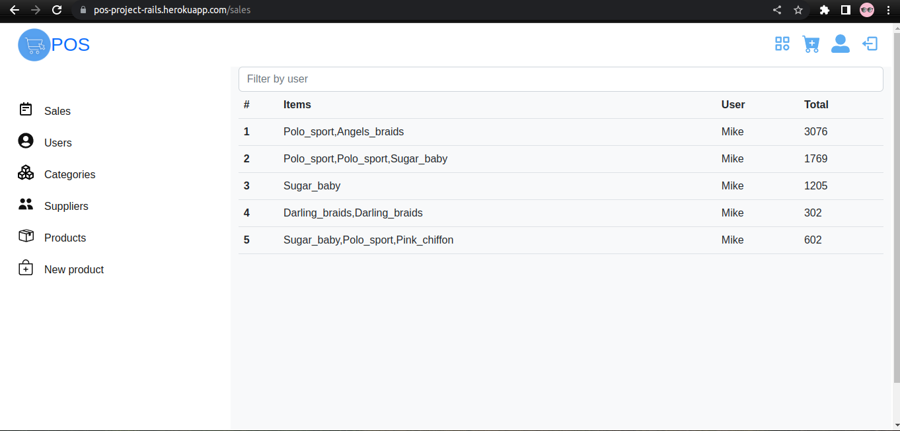
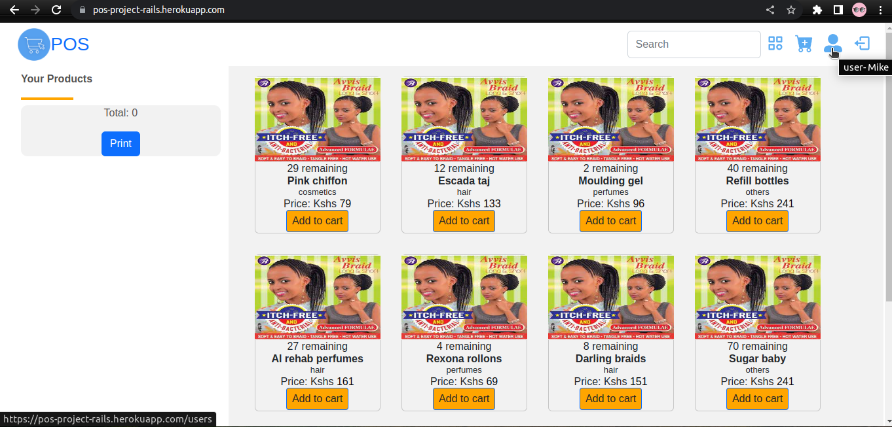
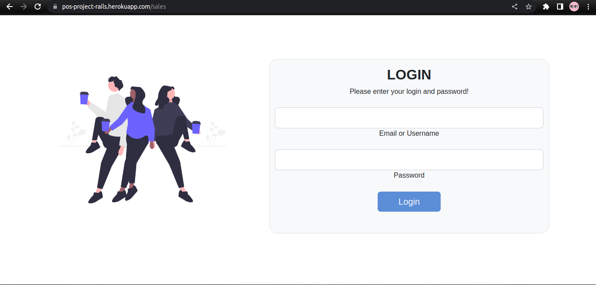

# POS (Point Of Sale) APP
<!-- Deployed link: <a href='https://pos-project-rails.herokuapp.com/'>here</a> -->

ERD(Entity Relationship Diagram) diagram: <a href='https://drawsql.app/teams/admissions/diagrams/point-of-sale'>here</a>





-u Mike -p 240322

This project simulates (or attempts to simulate) a point of sale system which manages stock quantity of a shop along with some few other functionalities which I'll get to in a bit... But first, I'll briefly introduce the models that we are dealing with here

<strong>User:</strong> In this setup, there are two sets of users differentiated by the permissions (admin rights) they have in accessing different parts of the app. But both parties are users in that they can all sell items from the home page.

<strong>Item:</strong> This is basically the goods being sold in exchange for cash. And a receipt is generated to verify the sale.

<strong>Category:</strong> Each item/product/goods lies under a category of some sort.

<strong>Supplier:</strong> The seller selling goods to the owner of the business for him/her to sell.

<strong>Sale:</strong> Evidence that a customer bought something from the seller

<strong>Customer:</strong> Buyer

## User Story
I'll start with the regular user then the admin

### Regular user
A user can login to the app if he has an account with a valid name and password.
This user can sell and generate a receipt based on what he/she sold.
Any attempts at trying to reach to other functionalities of the app will be futile (except logging out of-course)

### Admin user
This user can:
* Log in as an admin
* Sell items as usual
* View receipts generated by the sales
* Delete the receipts generated
* View, edit, delete an exiting user's information or create a new user. With this, the admin will be able to send a password to the new user's registered email account.
* View, edit, delete an exiting category's information or create a new category
* View, edit, delete an exiting supplier's information or create a new supplier.
* View, edit, delete an exiting item's information or create a new item
* View, or delete a sale's information. I intentionally left the ability to edit a receipt's information out
### 

## Local Setup (client and server side)
To run the server locally, clone the code and run the following commands;
```
bundle install
rails db:migrate db:seed
rails s
```
This will set up the server, with some random seed data.

```
npm install --prefix client
npm start --prefix client
```
This will set up the client side.

## Stack
React v18.2.0

Ruby v2.7.4

Rails v6.1.7

Bootstrap v5
